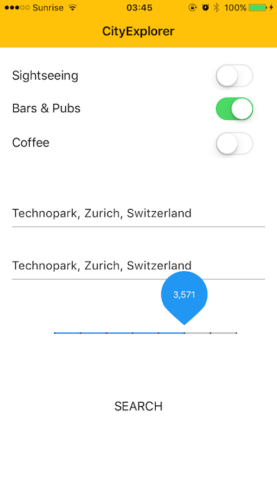
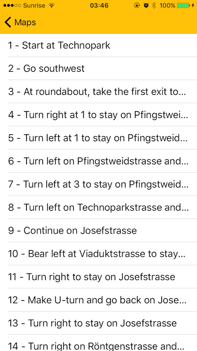

# CityExplorer - A prototype for Computational Tourism
A HackZurich project by [Jurgen Cito](https://github.com/citostyle) and [Giovanni Grano](https://github.com/giograno)

## CityExplorer - A prototype for Computational Tourism

Visiting new places is **exciting**! Exactly figuring what you want to visit? _ Not so much _. It means researching different sources of information about sights, cafes, and pubs, figuring out exactly how to get there, and finally how to make all these stops in a constrained time frame. 
The data on interesting locations is available is out there. APIs like Google Places or Foursquare provide a rich platform to extract what travelers crave. It is just hard to quickly make sense of all of it for the purpose of planning your trip.

Our idea of computational tourism leverages this plethora of information and allows users to express their preferences as high-level goals. We figure out the exact trip to see all of it. 

We have a perfect example here at HackZurich for everyone, not from the city: "I want to experience some of the nightlife in the area. Show me all bars I can visit in a 2-hour break, I want to spend around 30 minutes in each bar". Given these high-level preferences, CityExplorer retrieves all necessary location data, considers all these wishes and plans a perfect Pub Crawl route!

We implemented a proof-of-concept as a web application (mostly Javascript) and a native iPhone app in iOS, using esriMaps, with a backend in Python and the Google Maps API.

Here you can see a few screenshots of the web application and multiple screens of the iOS app.

